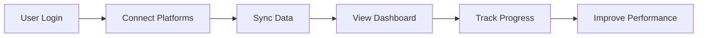
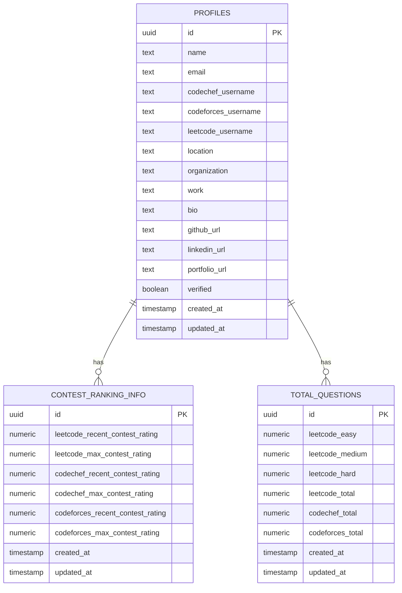

<div align="center">
  
  
  
  
</div>

<h1 align="center">🚀 CPier - Competitive Coding Tracker</h1>

<p align="center">
  <strong>Your ultimate companion for competitive programming excellence</strong>
</p>

<p align="center">
  <a href="#-features">Features</a> •
  <a href="#-demo">Demo</a> •
  <a href="#-getting-started">Getting Started</a> •
  <a href="#-tech-stack">Tech Stack</a> •
  <a href="#-api">API</a> •
  <a href="#-contributing">Contributing</a>
</p>

<p align="center">
  
  
  
  
</p>

---

## 📖 About

CPier is a **comprehensive platform** designed for competitive programmers to **track their progress** across multiple coding platforms in one **unified dashboard**. Whether you're preparing for coding interviews or competing in contests, CPier provides the insights and tools you need to excel.

> **🎯 Mission**: Empower competitive programmers with data-driven insights to improve their coding performance and achieve their goals.

---

## ✨ Features

### 🎯 Multi-Platform Integration
<table>
<tr>
<td width="50%">

**🔗 Connect All Your Profiles**
- LeetCode profile sync
- CodeChef statistics tracking
- CodeForces performance monitoring
- Automatic data updates

</td>
<td width="50%">

**📊 Unified Dashboard**
- Single view of all platforms
- Real-time statistics
- Performance comparisons
- Progress tracking

</td>
</tr>
</table>

### 📈 Performance Analytics
<table>
<tr>
<td width="50%">

**📉 Contest Rankings**
- Current and max ratings
- Rating progression charts
- Platform comparisons
- Growth predictions

</td>
<td width="50%">

**🔥 Problem Statistics**
- Difficulty-wise breakdown
- Topic-wise analysis
- Solving patterns
- Success rates

</td>
</tr>
</table>

### 📅 Contest Management
<table>
<tr>
<td width="50%">

**🗓️ Unified Calendar**
- All contests in one place
- Platform-specific filters
- Personalized recommendations
- Export to calendar apps

</td>
<td width="50%">

**⏰ Smart Reminders**
- Never miss contests
- Custom notifications
- Preparation tips
- Registration deadlines

</td>
</tr>
</table>

---

## 🚀 Demo

### 🎬 Quick Preview



### 📱 Key Screens

| Dashboard | Profile | Analytics |
|-----------|---------|-----------|
| 📊 Unified view of all platforms | 👤 Complete profile management | 📈 Performance trends |
| 🎯 Quick stats overview | 🔗 Platform connections | 📉 Contest history |
| 📅 Upcoming contests | 🏆 Achievements showcase | 🔥 Activity heatmaps |

---

## 🛠️ Tech Stack

### 🎨 Frontend
<div align="center">

```js
const frontend = {
  framework: "React 19",
  bundler: "Vite",
  styling: "Tailwind CSS",
  animations: "Framer Motion",
  routing: "React Router",
  charts: ["ApexCharts", "Recharts"],
  icons: "Lucide React",
  state: "React Context"
}
```

</div>

### ⚙️ Backend
<div align="center">

```js
const backend = {
  runtime: "Node.js",
  framework: "Express.js",
  database: "Supabase (PostgreSQL)",
  auth: "Supabase Auth",
  api: "RESTful APIs",
  security: ["Helmet", "CORS", "JWT"],
  monitoring: "Morgan"
}
```

</div>

### 🗄️ Database Architecture
<div align="center">

```sql
-- Core Tables
profiles              -- User information
contest_ranking_info  -- Contest ratings
total_questions       -- Problem statistics
```

</div>

---

## 🚀 Getting Started

### 📋 Prerequisites
- **Node.js** (v18 or higher)
- **npm** or **yarn**
- **Supabase** account and project

### ⚡ Quick Start

#### 1️⃣ Clone & Install
```bash
# Clone the repository
git clone https://github.com/Abhaykk615/cp-tracker.git
cd cp-tracker

# Install backend dependencies
cd backend
npm install

# Install frontend dependencies
cd ../frontend
npm install
```

#### 2️⃣ Environment Setup
```bash
# Backend (.env)
cp backend/.env.example backend/.env
# Configure your Supabase credentials

# Frontend (.env)
cp frontend/.env.example frontend/.env
# Configure your API endpoints
```

#### 3️⃣ Database Setup
```bash
# Follow DATABASE_SETUP.md
# Create tables in Supabase
# Configure RLS policies
```

#### 4️⃣ Run Development Servers
```bash
# Backend (Terminal 1)
cd backend
npm run dev
# 🚀 Server running on http://localhost:3000

# Frontend (Terminal 2)
cd frontend
npm run dev
# 🎨 App running on http://localhost:5173
```

---

## 🔧 Configuration

### 🌍 Environment Variables

#### Backend Configuration
```env
# Supabase
SUPABASE_URL=your_supabase_url
SUPABASE_ANON_KEY=your_supabase_anon_key
SUPABASE_SERVICE_ROLE_KEY=your_supabase_service_role_key

# Server
PORT=3000
NODE_ENV=development
FRONTEND_PROD_URL=your_production_frontend_url
```

#### Frontend Configuration
```env
# Supabase
VITE_SUPABASE_URL=your_supabase_url
VITE_SUPABASE_ANON_KEY=your_supabase_anon_key

# API
VITE_API_URL=http://localhost:3000
```

---

## 📊 Database Schema

### 🏗️ Table Structure



---

## 🔌 API Documentation

### 🔐 Authentication
```http
POST /api/users/login
POST /api/users/signup
POST /api/users/logout
```

### 📊 Platform Data
```http
GET  /api/leetcode/profile/:username
GET  /api/codechef/profile/:username
GET  /api/codeforces/profile/:username
```

### 📈 Analytics
```http
GET  /api/dashboard/stats/:userId
GET  /api/dash/heatmap/:userId
GET  /api/contests/upcoming
```

---

## 🎯 Key Features Deep Dive

### 🔄 Real-time Synchronization
- **Automatic Updates**: Fetch latest data every 24 hours
- **Manual Sync**: On-demand data refresh
- **Error Handling**: Robust error recovery
- **Rate Limiting**: Respect platform API limits

### 📊 Advanced Analytics
- **Performance Trends**: Track improvement over time
- **Contest Analysis**: Detailed contest performance
- **Problem Patterns**: Identify strengths and weaknesses
- **Comparative Analysis**: Compare with peers

### 🎨 User Experience
- **Responsive Design**: Works on all devices
- **Dark Mode**: Easy on the eyes
- **Smooth Animations**: Delightful interactions
- **Fast Loading**: Optimized performance

---

## 🔒 Security Features

### 🛡️ Data Protection
- **Row Level Security**: Users can only access their data
- **JWT Authentication**: Secure token-based auth
- **HTTPS Only**: Encrypted communication
- **Input Validation**: Prevent SQL injection and XSS

### 🔐 Privacy Controls
- **Data Minimization**: Only collect necessary data
- **User Consent**: Explicit permission for data access
- **GDPR Compliant**: Follow privacy regulations
- **Data Deletion**: Remove data on request

---

## 🚀 Deployment

### 🌐 Frontend Deployment (Vercel)
```bash
cd frontend
npm run build
vercel --prod
```

### ⚙️ Backend Deployment (Railway)
```bash
cd backend
npm start
# Deploy to Railway, Heroku, or similar
```

### 🗄️ Database (Supabase)
- **Production**: Use Supabase Pro
- **Staging**: Separate staging project
- **Backups**: Automated daily backups
- **Monitoring**: Real-time performance metrics

---

## 🤝 Contributing

This is currently a **solo project** developed by **Abhaykk615**. While I appreciate interest in the project, I'm focusing on maintaining the vision and quality of CPier as a personal endeavor.

### 🎯 Project Philosophy
- **Quality over Quantity**: Focus on well-crafted features
- **User-Centric**: Every feature solves real user problems
- **Clean Code**: Maintainable and readable codebase
- **Performance**: Fast and efficient user experience

### 📝 Feedback & Suggestions
- 🐛 **Bug Reports**: Welcome via GitHub Issues
- 💡 **Feature Ideas**: Open to suggestions
- 📧 **Direct Contact**: For collaborations or inquiries

---

## 🏆 Acknowledgments

### 🙏 Special Thanks
- **Supabase Team** - For the amazing BaaS platform
- **React Community** - For the incredible ecosystem
- **Competitive Programmers** - For inspiration and feedback

### 📚 Resources
- [LeetCode API](https://leetcode.com/api/)
- [CodeChef API](https://www.codechef.com/api/)
- [CodeForces API](https://codeforces.com/api/help)

### 🌟 About the Developer
This project is developed and maintained by **Abhaykk615** with passion for competitive programming and data visualization.

---

## 📞 Support & Contact

### 🆘 Get Help
- 📧 **Email**: support@cpier.dev
- 💬 **Discord**: [Join our community](https://discord.gg/cpier)
- 🐛 **Issues**: [Report bugs](https://github.com/Abhaykk615/cp-tracker/issues)
- 📖 **Documentation**: [Wiki](https://github.com/Abhaykk615/cp-tracker/wiki)

### 📜 Legal
- **Privacy Policy**: [Link](/privacy)
- **Terms of Service**: [Link](/terms)
- **License**: [ISC License](LICENSE)

---

## 📈 Project Stats

<div align="center">

| Metric | Value |
|--------|-------|
| ⭐ Stars |  |
| 🍴 Forks |  |
| 🐛 Issues |  |
| 📝 License |  |

</div>

---

<div align="center">
  <strong>🚀 Made with ❤️ by <a href="https://github.com/Abhaykk615">Abhaykk615</a></strong>
</div>

<div align="center">
  <sub>© 2025 CPier. All rights reserved.</sub>
</div>
